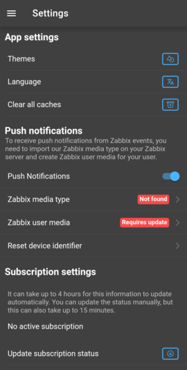
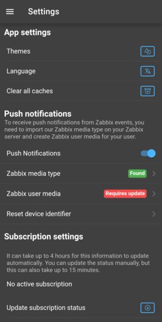
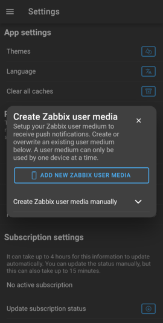
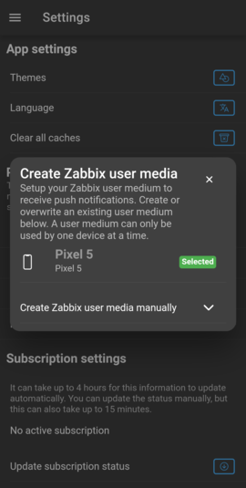

# IntelliTrend Mobile Zabbix Mediatype

This Zabbix media type template can be used to enable push notifications to your smartphone or tablet via the DataForge app.

## Requirements

* Zabbix 6.0 or higher
* DataForge app 6.0 or higher

## Installation

You can use the DataForge App to configure your user to receive push notifications.

If you log in to your Zabbix instance as a DataForge user and then click `Settings` in the main menu, you should see this screen:

Initially, you will see `Not found` for the Zabbix media type, so you need to install this media type first.

Log in to your Zabbix frontend, then navigate to `Alerts` &rarr; `Media types` (Zabbix 6.4) or `Administration` &rarr; `Media types` (Zabbix 6.0) and click on `Import` on the top right bar.

Then, in the dialog window, select `intellitrend_mobile.yaml` and click on `Import`. You can download the file from this repository.

When you now switch back to the DataForge app and refresh the settings view, you should see this instead:

The Zabbix media type should now be found. The next step is to create a user media for your current user. Click on `Zabbix user media` to open this screen:

Click on the blue button to confirm creating a new user media for push notifications. After a few seconds, your device is registered and you should see it on the screen:

That's it! You can now close the dialog and configure your alerts in DataForge to receive notifications when problems appear in Zabbix.

To see past notifications, you can always go to `Notifications` to view them. Here, you can also mark notifications as read or delete them permanently.