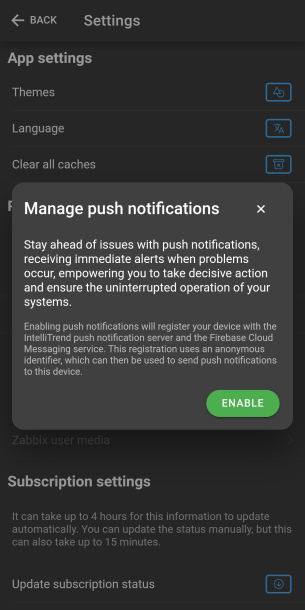
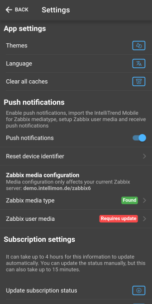
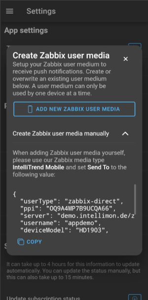
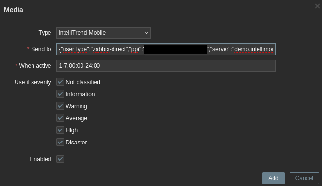
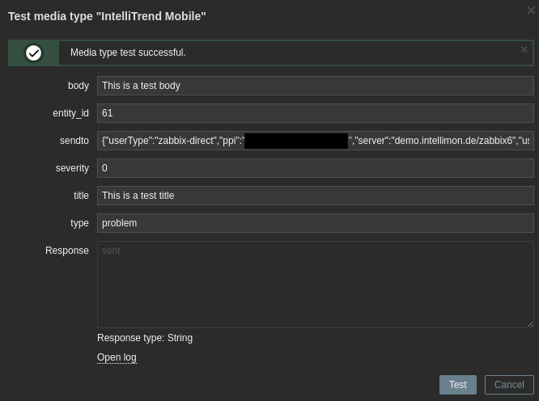

# IntelliTrend Mobile Zabbix Mediatype

This Zabbix media type can be used to send push notifications to your smartphone or tablet via the **IntelliMon Mobile** for Zabbix app, available for IOS and Android.

## Requirements

* Zabbix 6.0 or higher
* IntelliMon Mobile for Zabbix App 6.8 or higher

## Installation

To setup push notifications, you must enable push notifications in your **IntelliMon Mobile** app, install the media type provided in this repository and create a Zabbix user media with the parameters provided by the IntelliMon Mobile app.

> **NOTE:** Depending on your Zabbix user type the IntelliMon Mobile app may be able to automatically create your user media for you. For more information see step 3.

If you don't have the IntelliMon Mobile app yet, you can get it here:
* [Google Play](https://play.google.com/store/apps/details?id=de.intellitrend.intellimonmobile&hl=en_US)
* [Apple App Store](https://apps.apple.com/us/app/intellimon-mobile-for-zabbix/id1639789657)

### Step 1: Enable push notifications in the app
Open the IntelliMon Mobile app, sign in using either a `Zabbix Direct` or `DataForge User` account if you have not already and then navigate to the `Settings` page using the sidebar, you should see the following screen:

On this screen, press the `Push Notifications` toggle to enable Push Notifications. After pressing the toggle, the following modal should appear:

Once the modal has appeared, press the enable button in the bottom right corner. Upon pressing this button, a modal from your device's operating system will appear, asking you to grant push notification permissions to the app. Make sure to grant the app this permission.

At this point push notifications are enabled in your app, but both your Zabbix media type and your Zabbix user media are still not setup. You should now see the following screen on the settings page, note that the Zabbix media type was not found and the Zabbix user media is not configured yet:

### Step 2: Install the media type in Zabbix
The next step is to install the IntelliTrend Mobile media type from this repository in Zabbix.

#### 2.1 Download the media type
To install the media type on your Zabbix server, click on the file `intellitrend_mobile.yaml` and then press the download raw file button.

#### 2.2 Import the media type
Next, sign in to your Zabbix frontend, navigate to `Alerts` &rarr; `Media types` (Zabbix 6.4) or `Administration` &rarr; `Media types` (Zabbix 6.0) and click on `Import` on the top right bar.

Then, in the dialog window, select the previously downloaded `intellitrend_mobile.yaml` and click on `Import`.

> **NOTE:** In case you want to update an existing version of the IntelliTrend Mobile media type, make sure to also check the 'Update Existing' checkbox

After clicking import, the IntelliTrend Mobile media type should now appear in the list of media types:

#### 2.3 Check that the media type is detected
To check if the media type has been correctly installed and is detected by the IntelliMon Mobile app, open the IntelliMon Mobile app, navigate away from the settings page and then back onto it, to refresh the shown data. After doing this, you should see the following screen, indicating that the Zabbix media type was found but the Zabbix user media is still not configured:

### Step 3: Setup your user media
Now that the media type has been installed in your Zabbix server and is detected by the IntelliMon Mobile app, you need to set up your user media. There are two ways this can be done, depending on your user type within Zabbix.

#### Option 1: Privileged user (Zabbix user type `Admin` or `Superadmin`)
If you have the User type Admin or the User type Superadmin, you can set up the required user media using the IntelliMon Mobile app's built-in convenience feature. To do this, simply tap on `Zabbix user media` on the settings page, this should open the Zabbix user media creation modal. There are two possible scenarios here:

##### First time setup
If you have never setup push notifications for this user before, you should see the following screen:

In this case, simply tap the `Add new Zabbix user media` button to create a new user media in Zabbix. After creating a new user media, you should see the following screen, indicating that the media has been created and is bound to this app installation:

##### Reactivation / Multiple devices
If this is not the first push notification setup for this Zabbix user, there may already be devices listed in addition to the `Add new Zabbix user media` button:

In this case, look for your current device in the list of devices and simply tap it to bind it to your current app installation. If your current device does not appear in the list simply tap the `Add new zabbix user media` button to create a new user media for this device.

> **NOTE:** Pressing the delete button on a device entry, will delete the corresponding user media in Zabbix. This is useful if one of your devices is no longer in use. Do not delete an entry if that entry is in use by another device of the same Zabbix user.

After activating a user media from the list or creating a new user media, you should see the following screen, indicating that the user media was bound to this installation:

#### Option 2: Unprivileged user (Zabbix user type `User`)
If you do not have the user type Admin or the user type Superadmin, you do not have the required permissions to edit Zabbix user media yourself. In this case, you will need the assistance of your Zabbix administrator to create your user media in Zabbix.

Tap on the `user media` item on the settings page, expand the `Create Zabbix user media manually` section and click the copy button to copy your configuration to the clipboard:

Then provide this configuration string to your Zabbix administrator, so they can create a user media for you.

To create the required user media, the Zabbix administrator must first navigate to `Users` &rarr; `Users` (Zabbix 6.4) or `Administration` &rarr; `Users` (Zabbix 6.0) and then click on your User. Next, they must navigate to the `Media` tab in the top bar and then click the `Add` button.

In this modal, select the IntelliTrend Mobile media type and then paste the configuration string provided by the user into the `Send to` field. Optionally, you can set up a schedule when push notifications should be active using the `When active` field or a severity filter using the `Use if severity` checkboxes:

> **NOTE:** User media that were created automatically using the IntelliMon Mobile app also show up in the list of user media of their respective user in Zabbix

### Step 4: Configure notifications
At this point, your settings page should look as follows, indicating that the Zabbix media type was found and the Zabbix user media configuration is ok:

You can now sign in to the Zabbix Frontend and configure alerts with operations as you would for any other media type. Existing trigger actions that use the `Send only to: All` option will now also begin sending push notifications with the IntelliMon Mobile app.

For example, to only receive push notifications when a problem arises, simply configure a trigger action and then select the IntelliTrend Mobile media type from the list of media types. Of course, you can also select all media types if you do not want to limit alerts to push notifications:

### DataForge

If you are a DataForge user, you can use our convenient alert management feature found under `Self Provisioning` &rarr; `Alerts`, to configure alerts with a few clicks, directly from the IntelliMon Mobile app.

Simply select the hostgroup you wish to be alerted for from the list, choose the minimum severity you would like to be alerted at, select if you would also like to be alerted for subgroups and click subscribe:

DataForge will automatically configure the required trigger action in Zabbix, so you can easily manage alerts from your mobile device.

If you are interested in DataForge, click [here](https://www.intellitrend.de/cms/en/dataforge/) to learn more.

### FAQ

#### Why can regular Zabbix user (user type user) not add the user media through the app?
Zabbix does not allow users that do not have either the user type admin or superadmin to create user media, even if they are creating it for themselves.

#### Can I rename the 'IntelliTrend Mobile' media type after importing it?
No. Our app checks for the media type by name, so renaming it will cause the app to no longer detect the media type.

#### I am not receiving push notifications, how can I troubleshoot this problem?

If you are having trouble getting push notifications to work, you can perform the following troubleshooting steps:

**Step 1: Ensure notifications are set up correctly in the app**

Navigate to the `Settings` page in the IntelliTrend Mobile app and ensure that your push notification section looks as follows, indicating that push notifications are enabled, the push media type is detected and that the user media exists and is up-to-date:

**Step 2: Check for trigger action errors in Zabbix**

Sign in to Zabbix and navigate to `Monitoring` &rarr; `Problems`, and click the icon displayed under actions, giving you an overview over the actions that were sent and if they had an error or not. Alternatively you can also check the action log, which can be accessed by navigating to `Reports` &rarr; `Action log`, to get an overview over all sent alerts.

If your alert shows up with the error `invalid credentials`, go back into the IntelliTrend Mobile app and double check that your `Zabbix user media` has the status `OK`. If this is the case, tap `Reset device identifier` and then confirm the reset in the modal that opens. After this update your user media and try again. If this does not fix the problem please contact customer support support@intellitrend.de.

> **NOTE:** Depending on your user type, resetting your device identifier may require the assistance of your Zabbix administrator to update your user media with the new device identifier, as explained previously.

If your alert shows up with any other error, try again after some time. If the issue persists, please contact customer support at support@intellitrend.de.

In case your alert does not show up in this list, your trigger action configuration is incorrect. You can validate that the setup works by performing a manual test as described below.

#### When do I need to update my Zabbix user media?
Your Zabbix user media requires an update whenever your persistent push identifier (PPI) changes. This can occurr when uninstalling, reinstalling, or updating the IntelliMon Mobile app and after using the `Reset device identifier` option.

If your PPI has changed, simply sign in to an account on your Zabbix server using the IntelliMon Mobile app, navigate to the `Settings` page and update your user media by tapping the `User media` item and then selecting your device in the device selection modal as described in `Step 3`.

#### How can I test the IntelliTrend Mobile media type?
To test the IntelliTrend Mobile media type, begin by navigating to `Alerts` &rarr; `Media types` (Zabbix 6.4) or `Administration` &rarr; `Media types` (Zabbix 6.0) and clicking the test button for the IntelliTrend Mobile media type.
This should cause the following modal to open:

Begin by setting the `title` and `body` fields to any test string you like. 

Set the `entity_id` field to a valid Zabbix event ID, which you can obtain by navigating to `Monitoring` &rarr; `Problems`, clicking on a problem and then copying the event ID from the URL. 

Set the `severity` field to a valid numeric severity such as `2` for `warning`. Check [this](https://www.zabbix.com/documentation/current/en/manual/api/reference/event/object) documentation page and scroll down to the `severity` property if you are unsure about numeric severities.

To set the `sendto` parameter, open the IntelliMon Mobile app, navigate to the `Settings` page, ensure that push notifications are enabled and then tap on `Zabbix user media`. In the user media modal, expand the `Create Zabbix user media manually` section and press the copy button to copy the configuration to your clipboard. Now paste this configuration into the media types `sendto` parameter.

Finally, press the `Test` button:

And view the notification on your device:

